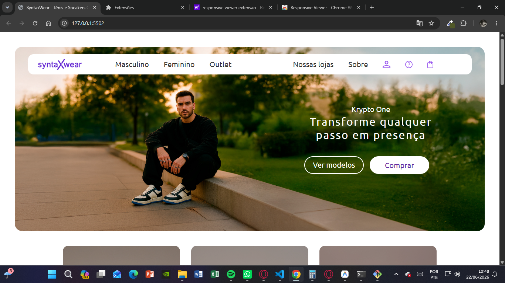

# SyntaxWear - E-commerce de Tênis e Sneakers 👟

Bem-vindo ao repositório do **SyntaxWear**, uma interface web moderna para uma loja online de calçados (tênis e sneakers). Este projeto foi desenvolvido focado em práticas modernas de **HTML5** e **CSS3**, com um layout totalmente responsivo e otimizado para diferentes dispositivos (computadores, tablets e celulares).

---

## 📥 Clonando o Projeto

```bash
git clone https://github.com/JulioDiniz2008/ecommerce-syntaxwear.git
cd ecommerce-syntaxwear
```

---

## 📸 Preview



---

## 🛠️ Tecnologias Utilizadas

Este projeto foi construído utilizando tecnologias nativas da web (sem a necessidade de frameworks complexos), garantindo rapidez no carregamento e facilidade de entendimento para quem está iniciando na programação web:

*   **HTML5 Semântico:** Uso de tags estruturais como `<header>`, `<main>`, `<section>`, `<nav>`, e `<footer>` para melhor legibilidade do código e otimização para SEO e acessibilidade.
*   **CSS3 Moderno:**
    *   **CSS Grid Layout (Áreas Nomeadas):** Usado para construir a grade complexa de exibição de produtos de forma simples e intuitiva.
    *   **Flexbox:** Utilizado para alinhar menus de navegação, rodapé e alinhar conteúdo vertical/horizontalmente.
    *   **CSS Variables (Variáveis CSS):** Centralização de padrões visuais (como fontes e cores) para fácil manutenção.
    *   **CSS Media Queries:** Responsividade que adapta o design para telas de desktops, tablets e celulares.
    *   **Checkbox Hack:** Uma técnica elegante no CSS para criar um menu hambúrguer interativo para dispositivos móveis sem precisar de uma única linha de JavaScript!

---

## 📂 Estrutura de Arquivos

A organização das pastas foi estruturada de forma limpa e modular. Cada componente visual tem seu próprio arquivo de estilo CSS, facilitando na manutenção do código:

```text
ecommerce-syntaxwear/
├── css/                             # Estilos da aplicação
│   ├── components/                  # Estilos específicos de cada componente
│   │   ├── footer.css               # Estilização do rodapé
│   │   ├── header.css               # Estilização do cabeçalho e menu mobile
│   │   ├── hero.css                 # Banner principal com chamada para ação (CTA)
│   │   ├── product-category.css     # Seção com os cards das categorias de tênis
│   │   └── product-grid.css         # Grade dinâmica de exibição de produtos
│   ├── base.css                     # Configurações globais e estilos de botões (.btn)
│   ├── reset.css                    # Reseta margens e paddings padrão do navegador
│   └── variables.css                # Importação de fontes e definição de variáveis CSS
├── imagem/                          # Imagens e ativos visuais do projeto
│   ├── banners/                     # Banners do Hero (desktop e mobile)
│   ├── favicon/                     # Ícones da guia do navegador
│   ├── icons/                       # Ícones SVG (usuário, sacola, redes sociais, hambúrguer)
│   ├── logo/                        # Logotipo da SyntaxWear
│   └── products/                    # Fotos dos produtos e categorias
├── index.html                       # Estrutura HTML principal da página inicial
└── README.md                        # Documentação do projeto (este arquivo!)
```

---

## 💡 Conceitos Importantes Explicados (Para Iniciantes)

Se você está estudando desenvolvimento web frontend, este projeto é um ótimo exemplo prático de duas técnicas muito poderosas do CSS:

### 1. O "Checkbox Hack" (Menu Mobile Sem JavaScript)
Em telas menores (celulares), o menu precisa abrir e fechar. Tradicionalmente usa-se JavaScript para isso, mas aqui usamos apenas HTML e CSS! Como funciona?
*   No **HTML**, temos um `input` invisível do tipo checkbox (`#menu-toggle`) e um `label` com o ícone hambúrguer associado a ele.
*   Quando você clica no ícone, ele marca (ativa) o `checkbox`.
*   No **CSS** (`css/components/header.css`), usamos o seletor irmão `~` combinando com a pseudo-classe `:checked`:
    ```css
    .menu-toggle:checked ~ .nav-container {
        right: 0; /* Move o menu de volta para a tela */
    }
    ```
    Isso faz com que, quando o checkbox estiver marcado, o contêiner do menu deslize suavemente para dentro da tela.

### 2. CSS Grid com Áreas Nomeadas (`grid-template-areas`)
Para fazer aquele painel de fotos na seção de produtos (`.grid-section`), usamos o CSS Grid de forma muito didática:
No arquivo `css/components/product-grid.css`, nós nomeamos cada bloco de imagem com a propriedade `grid-area`. Depois, desenhamos visualmente a tabela no CSS:
```css
.grid-section {
    display: grid;
    grid-template-columns: repeat(4, 1fr); /* 4 colunas iguais */
    grid-template-rows: repeat(3, 300px);   /* 3 linhas de 300px */
    grid-template-areas:
        "highlight highlight sneaker-purple sneaker-purple"
        "highlight highlight model sneaker-color"
        "sneaker-white sneaker-white model sneaker-silver";
    gap: 30px;
}
```
*   O card com nome `highlight` ocupa as duas primeiras colunas das duas primeiras linhas.
*   O card `model` ocupa a terceira coluna na segunda e terceira linha.
*   Isso torna a criação de layouts complexos muito visual e fácil de codificar!

---

## 🚀 Como Executar o Projeto

Como o site é estático (apenas HTML e CSS), você não precisa instalar nenhum servidor complexo para vê-lo funcionar.

1. Abra o arquivo `index.html` diretamente em seu navegador web (Google Chrome, Firefox, Edge, etc.).

2. (Opcional) Instale a extensão **Live Server** no VS Code para atualizar a página automaticamente sempre que salvar alterações.

---

## 🎯 Sugestões de Evolução (Desafios para praticar)

Se você quer praticar e dar seus próximos passos no desenvolvimento web, aqui estão ótimas ideias para implementar neste projeto:

1.  **Adicionar efeito de transição suave no Menu Mobile:** Melhore a experiência visual suavizando a aparição do menu lateral usando `transition` no CSS.
2.  **Adicionar um Modal de Carrinho:** Crie um modal pop-up que aparece quando o usuário clica no ícone de sacola no menu superior.
3.  **Criar efeitos de Hover nos Cards de Produtos:** Adicione zoom suave nas imagens de tênis quando o mouse passar por cima deles (usando `transform: scale(1.03)` e `transition: transform 0.3s` no CSS).
4.  **Criar Páginas Adicionais:** Crie uma página simples de "Sobre nós" ou uma página de "Carrinho" e conecte-as usando links no menu do cabeçalho.

---
Desenvolvido com carinho para fins de aprendizado e desenvolvimento pessoal! 💻✨

---

## 👨‍💻 Autor

**Julio Diniz**

GitHub: https://github.com/JulioDiniz2008

Projeto desenvolvido para estudos de HTML5, CSS3, responsividade e boas práticas de desenvolvimento frontend.
